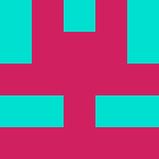

# awesome-identicon

Example:

Gravatar Example: https://www.gravatar.com/avatar/39b9df3a0fb3356d11a63e22260e96ab?s=270&d=retro&r=g

Fork simplifies the code and reduces the dependencies (removes Guava).